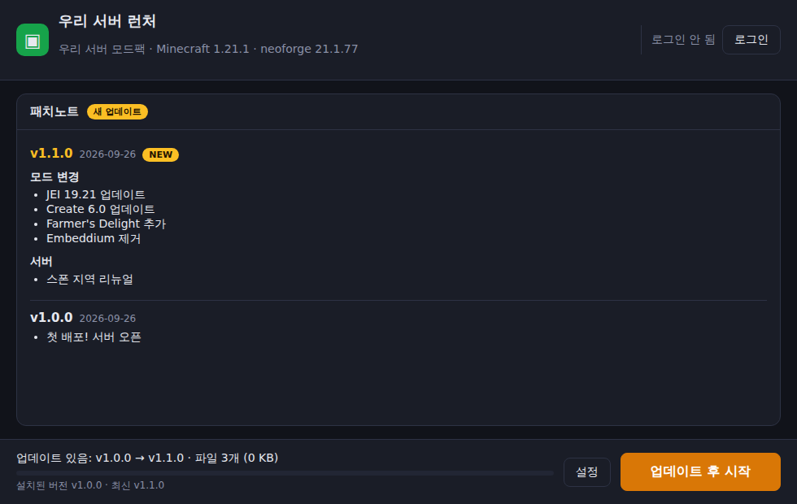

# 모드팩 자동 업데이트 런처

커스포지 모드팩을 **구글 드라이브 → 다운로드 → import → 설정/맵 데이터 옮기기** 식으로 배포하던 걸
**런처 하나 켜면 업데이트 확인 → 원클릭 패치 → 서버 자동 접속**으로 바꾸는 프로젝트입니다.
(Helios Launcher 와 같은 방식)



## 무엇이 달라지나

| 지금 | 런처 사용 시 |
| --- | --- |
| 새 버전 zip 을 드라이브에 올림 | `build-manifest` 한 줄 실행 후 결과 폴더 업로드 |
| 유저가 zip 받아서 커스포지에 import | 런처가 켜질 때 자동으로 새 버전 감지 |
| 매번 **새 인스턴스**가 생겨서 설정/미니맵/맵 데이터를 직접 옮김 | 같은 폴더를 **제자리 패치**하므로 옮길 필요 없음 |
| 전체 모드팩을 매번 다시 받음 | **바뀐 파일만** 받음 (해시 비교) |
| 업데이트 글을 따로 찾아봐야 함 | 런처 화면에 패치노트가 바로 뜸 (새 버전은 NEW 표시) |
| 유저가 자바, 네오포지 설치 | 런처가 자바 21(Temurin)/NeoForge 까지 알아서 설치 |

## 구조

```
관리자 PC                              웹 호스팅 (R2, 웹서버 등)              유저 PC
───────────                            ─────────────────────────              ────────
커스포지 인스턴스 폴더                  pack/manifest.json   ◀── 런처가 확인 ──  런처(.exe)
   │  node tools/build-manifest.js      pack/objects/ab/ab12…                  │
   └──────────────▶ pack-dist/ ──업로드──▶  (파일 내용 해시 이름)   ── 바뀐 파일만 ─▶  instance/
```

- `manifest.json`: 모드팩 버전, MC/로더 버전, 패치노트 이력, 파일 목록(경로 + SHA-1 + 크기)
- `objects/`: 실제 파일. 이름이 내용 해시라서 **새로 바뀐 파일만** 업로드하면 됨
- 런처는 로컬 파일과 매니페스트를 비교해서 필요한 파일만 받고, 받은 파일은 해시로 검증함

### 유저 데이터 보존 규칙

| 파일 종류 | 동작 |
| --- | --- |
| 매니페스트에 있는 파일 (mods, config, kubejs …) | 서버와 다르면 덮어씀 → 항상 서버와 동일 |
| `once` 파일 (기본: `options.txt`, `servers.dat`) | 처음 설치 때만 넣고 이후엔 **유저가 바꾼 값 유지** |
| 예전 버전에 있었는데 새 버전에서 빠진 파일 | 삭제 |
| `strictDirs`(기본: `mods`) 안에 유저가 직접 넣은 파일 | 서버와 모드 불일치 방지를 위해 `.launcher-backup/` 으로 **이동** (삭제 아님) |
| 그 외 전부 (saves, 스크린샷, journeymap/xaero 미니맵 데이터, 리소스팩 추가분 …) | **건드리지 않음** |

## 관리자 가이드

### 1. 처음 한 번: 런처 만들기

1. `launcher/launcher.config.json` 수정
   ```json
   {
     "appName": "우리 서버 런처",
     "dataFolderName": "our-server-launcher",
     "manifestUrl": "https://pack.example.com/manifest.json",
     "discordUrl": "https://discord.gg/xxxx",
     "websiteUrl": ""
   }
   ```
   - `dataFolderName`: 유저 PC 의 `%APPDATA%\<이름>` 에 게임이 설치됨. 배포 후엔 바꾸지 마세요.
   - `manifestUrl`: 아래 2번에서 만들 호스팅 주소
2. 필요하면 `launcher/package.json` 의 `productName`, `build.appId` 도 서버 이름으로 변경
3. 빌드
   - **GitHub Actions (추천, PC 에 아무것도 설치 안 해도 됨)**: `launcher-v0.1.0` 같은 태그를 푸시하면
     윈도우 설치 파일(`.exe`)이 만들어져 GitHub Releases 에 올라갑니다. Actions 탭에서 수동 실행도 가능.
   - 직접 빌드: `cd launcher && npm ci && npm run build:win` → `launcher/dist/*.exe`
4. 만들어진 `.exe` 를 유저들에게 **한 번만** 배포. 이후 모드팩 업데이트는 런처가 알아서 받습니다.

### 2. 처음 한 번: 파일 호스팅 준비

`manifest.json` 과 `objects/` 를 **직접 다운로드 가능한 URL** 로 올릴 곳이 필요합니다.

- **Cloudflare R2 (추천)**: 10GB 무료, 다운로드 트래픽 무료. 버킷 만들고 공개 도메인(r2.dev 또는 커스텀 도메인) 연결
- 자체 웹서버 / NAS / 서버 호스팅에 붙은 웹 공간 (nginx 등으로 폴더만 공개하면 됨)
- ⚠️ 구글 드라이브는 파일별 직접 링크가 안 되고 대용량 파일에 확인 페이지가 끼어서 **사용 불가**

### 3. 매번: 모드팩 업데이트 배포

1. 평소처럼 커스포지에서 모드팩 인스턴스를 수정하고 테스트
2. (처음 한 번) 인스턴스 폴더에 `pack.config.json` 을 둡니다 → [`tools/pack.config.example.json`](tools/pack.config.example.json) 참고
3. 패치노트를 `notes.md` 에 적고 빌드 (Node.js 20 이상 필요)
   ```bash
   node tools/build-manifest.js \
     --source "C:/Users/나/curseforge/minecraft/Instances/우리모드팩" \
     --out ./pack-dist \
     --version 1.3.0 \
     --notes-file notes.md
   ```
   - MC 버전과 NeoForge 버전(예: 1.21.1 / 21.1.77)은 커스포지의 `minecraftinstance.json` 에서 자동으로 읽습니다.
   - NeoForge 버전을 올리면 런처가 알아서 새 버전을 설치합니다.
   - `pack-dist` 폴더는 지우지 말고 계속 쓰세요 (이전 패치노트 이력을 여기서 이어 붙임).
4. `pack-dist` 업로드. **objects 먼저, manifest.json 마지막**에 올려야 업로드 도중 접속한 유저가 깨지지 않습니다.
   R2 + [rclone](https://rclone.org) 예시:
   ```bash
   rclone copy pack-dist/objects r2:my-bucket/objects
   rclone copy pack-dist/manifest.json r2:my-bucket
   ```
5. 끝. 유저가 런처를 켜면 (켜 둔 상태면 10분 안에) 업데이트 알림과 패치노트가 뜹니다.

### pack.config.json 옵션

| 키 | 기본값 | 설명 |
| --- | --- | --- |
| `packName` | `My Modpack` | 런처 상단에 표시할 이름 |
| `include` | mods, config, defaultconfigs, kubejs, scripts, resourcepacks, shaderpacks, options.txt, servers.dat | 배포할 파일/폴더 (글롭 `*`, `**` 사용 가능) |
| `exclude` | `**/*.disabled` 등 | 제외할 파일 |
| `once` | options.txt, servers.dat | 처음 설치 때만 넣는 파일 |
| `strictDirs` | `["mods"]` | 목록에 없는 파일을 백업 폴더로 치울 폴더 |
| `server` | 없음 | `{ "address": "play.example.com", "port": 25565 }` → 게임 시작 시 자동 접속 |
| `memory` | 없음 | `{ "recommendedMB": 6144 }` → 유저 기본 램 할당 (PC 램 - 2GB 를 넘지 않음) |
| `minecraft`, `loader` | 자동 감지 | 커스포지 인스턴스가 아닐 때 직접 지정. 예: `"loader": { "type": "forge", "version": "47.3.0" }` |
| `java` | 자동 | 자바 메이저 버전 강제 지정 (보통 필요 없음) |

## 유저 입장에서

1. 런처 설치 → 실행 → **로그인** (마이크로소프트 계정 창이 뜸, 한 번만)
2. **설치 후 시작 / 업데이트 후 시작** 버튼 한 번 → 필요한 파일 받고 바로 서버 접속
3. 설정에서 램 조절, 게임 폴더 열기, 파일 검사/복구 가능

## 개발

```bash
cd launcher
npm ci
npm test                                                   # 업데이트 엔진/빌드 도구 테스트
MODPACK_MANIFEST_URL=http://localhost:8000/manifest.json npm start   # 로컬 테스트 서버로 실행
```

```
launcher/
  launcher.config.json     런처 이름, 매니페스트 주소
  src/common/manifest.js   매니페스트 규칙 (빌드 도구와 공유)
  src/main/updater.js      업데이트 엔진: 비교(plan) → 적용(apply)
  src/main/game.js         자바/로더 설치, 게임 실행 (@xmcl/installer, @xmcl/core)
  src/main/auth.js         마이크로소프트 로그인 (msmc), 토큰 암호화 저장
  src/main/main.js         Electron 메인 프로세스
  src/renderer/            화면
tools/build-manifest.js    관리자용 매니페스트 생성기
```

## 알아둘 점

- **테스트 범위**: 업데이트 엔진(설치·업데이트·유저 파일 보존·손상 복구·체크섬 검증)과 화면은 자동 테스트와 실제 실행으로
  확인했습니다. 반면 **실제 마인크래프트 실행(로그인 → 자바/NeoForge 설치 → 게임 시작)은 개발 환경의 네트워크 제한 때문에
  돌려보지 못했습니다.** 유저들에게 배포하기 전에 본인 PC 에서 한 번 끝까지 실행해 보세요.
- **기준 환경은 1.21.1 NeoForge** 입니다. 설치/실행은 XMCL 라이브러리가 공식 NeoForge 설치 파일을 그대로 돌려서
  (post-processor 포함) 하고, 실행 인자는 공식 런처와 같은 방식으로 버전 JSON 에서 만듭니다.
  NeoForge 1.21.1 형태의 버전 JSON 으로 실제 java 명령줄(모듈 경로, ignoreList, 메인 클래스, 로그인·자동접속 인자)을
  만들어 검증하는 테스트가 있습니다. Forge·Fabric·Quilt 도 같은 경로로 동작하도록 되어 있습니다.
- **첫 실행은 오래 걸립니다**: 마인크래프트 본체 + 자바 21 + NeoForge 설치(패치 작업 포함)로 처음 한 번은 몇 분 걸립니다.
  두 번째부터는 파일 확인만 하고 바로 켜집니다.
- **마이크로소프트 로그인**: msmc 라이브러리의 기본 방식(마이크로소프트 로그인 창을 런처 안에 띄움)을 씁니다.
  여러 오픈소스 런처가 쓰는 방식이지만, 유저가 많아지면 Azure 앱을 직접 등록하고 Mojang 에 Minecraft API 사용 신청을
  하는 것을 권장합니다.
- **윈도우 SmartScreen**: 코드 서명을 하지 않은 exe 라서 처음 실행 시 "Windows 의 PC 보호" 경고가 뜹니다.
  "추가 정보 → 실행" 으로 넘어가면 됩니다. (없애려면 코드 서명 인증서 필요)
- **모드 재배포 라이선스**: 모드 파일을 직접 호스팅하는 방식이라, 일부 모드는 라이선스상 재배포가 금지되어 있을 수 있습니다.
  지인 서버 규모에서는 흔히 쓰는 방식이지만 공개 배포라면 확인하세요.
